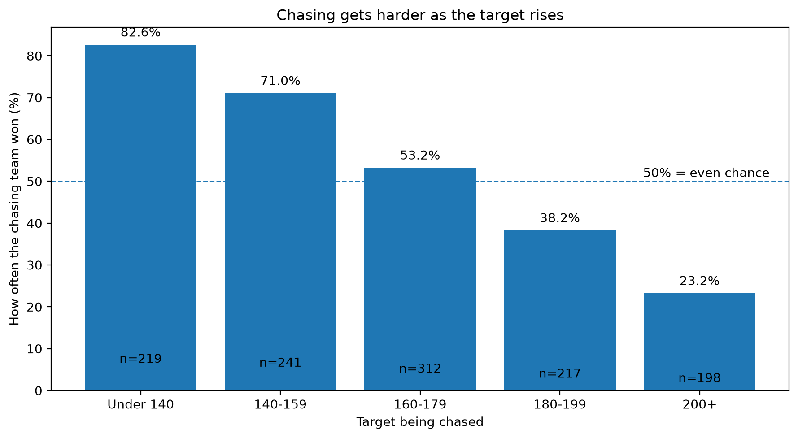
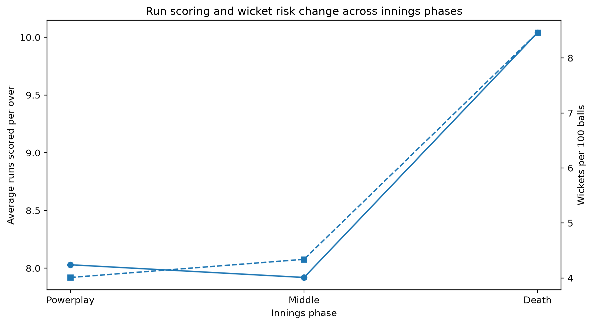
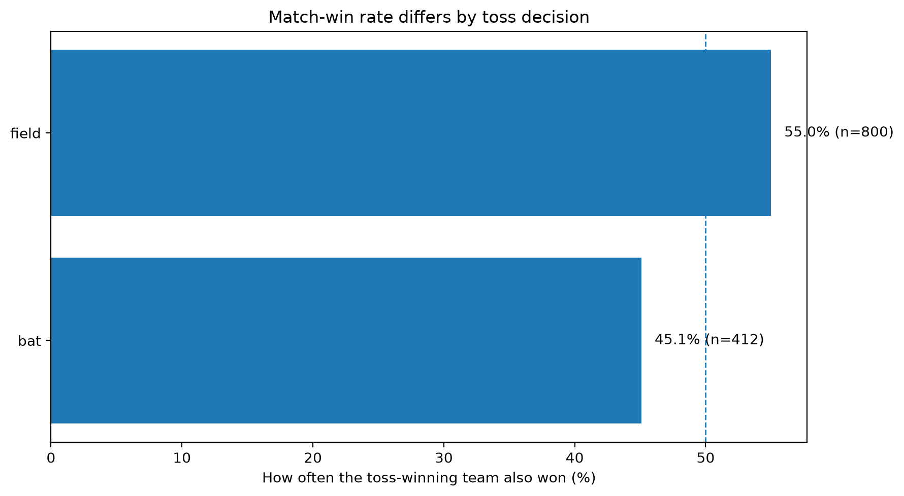
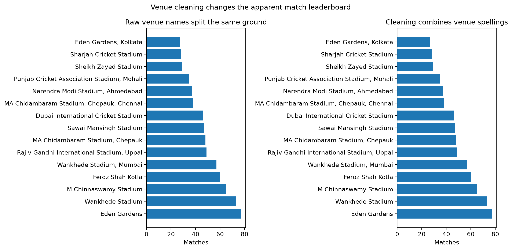
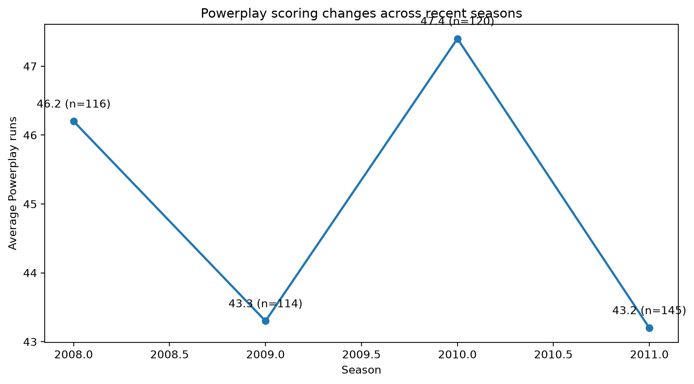

# IPL Cricket Analytics — Analysis Report

## Three findings I am least confident about

1. The Powerplay scoring pattern may vary by season and match conditions.
2. Toss-related differences may be affected by venue and team strength.
3. Venue comparisons depend on correct venue-name cleaning.

---

## Scenario H2

**Question:** Does chase success change by target band?

**Number:** See the chase win-rate chart for the percentage in each target band.

**Population:** Matches/chases grouped by first-innings target band.

**Decision:** The target size can be considered when deciding whether to chase aggressively.

**Doubt:** Other factors such as team strength, venue and match conditions may affect chase success.

---

## Scenario C1

**Question:** How do run scoring and wicket risk change across innings phases?

**Number:** Powerplay, Middle Overs and Death phases are compared using runs per over and wickets per 100 balls.

**Population:** Legal deliveries in the analysed innings phases.

**Decision:** Teams can use the phase-level scoring and wicket pattern when planning batting and bowling strategies.

**Doubt:** Phase averages can hide differences between teams, venues and individual matches.

---

## Scenario G3

**Question:** Does the toss decision relate to match wins?

**Number:** Match-win percentage is compared for the different toss decisions.

**Population:** Matches grouped by toss decision.

**Decision:** The toss decision can be considered together with venue and match conditions rather than looking only at the toss result.

**Doubt:** Toss decision alone does not explain match outcomes.

---

## Scenario I1

**Question:** How does venue cleaning change the venue match leaderboard?

**Number:** Raw venue names are compared with cleaned venue names.

**Population:** Matches grouped by raw and cleaned venue names.

**Decision:** Use cleaned venue names for venue-level analysis so different spellings do not split the same ground.

**Doubt:** Cleaning depends on the rules used to standardize venue names.

---

## Specialism Finding

**Question:** How does average Powerplay scoring change across seasons?

**Number:** Average Powerplay runs are compared across the selected seasons.

**Population:** Powerplay innings included in the selected seasons.

**Decision:** Powerplay scoring patterns can be considered when planning the start of an innings.

**Doubt:** A season-level average does not explain differences between teams, venues or individual matches.

